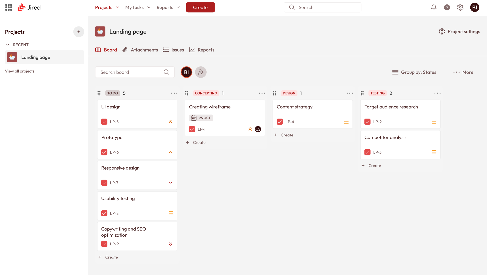

# Jired

**Автоматизированная система визуализации ведения проектов с интеллектуальной категоризацией задач**





## 📖 О проекте

Jired — это современный веб-клиент для системы управления проектами [Redmine](https://www.redmine.org/), расширяющий её функциональность за счёт:

- Удобной Kanban-доски с поддержкой drag-and-drop,
- Автоматической семантической группировки задач с использованием больших языковых моделей (LLM),
- Наглядной визуализации зависимостей и аналитических отчётов (диаграмма Ганта, burndown chart).

Система разработана в рамках выпускной квалификационной работы (ВКР) на кафедре ИУ5 МГТУ им. Н.Э. Баумана. Jired работает как надстройка над существующим Redmine через его REST API, не требуя миграции данных или изменения серверной инфраструктуры.

---

## 🚀 Основные возможности

- **Управление проектами и задачами** — создание, редактирование, назначение исполнителей, отслеживание статусов.
- **Kanban-доска** — визуальное управление потоком задач с перетаскиванием карточек между колонками.
- **Интеллектуальная категоризация** — автоматическое предложение групп задач на основе семантического анализа названий и описаний (через LLM API).
- **Ручная группировка** — возможность самостоятельно объединять задачи в логические группы.
- **Визуализация зависимостей** — отображение связей «блокирует/блокируется» и «предшествует/следует».
- **Аналитические отчёты**:
  - Диаграмма Ганта с учётом зависимостей и сроков.
  - График сгорания задач (Burndown Chart).
- **Интеграция с Redmine** — бесшовная работа с существующей базой проектов и задач.
- **Контейнеризация** — быстрый запуск всех компонентов через Docker Compose.

---

## 🛠️ Технологический стек

| Компонент       | Технологии                                                                 |
|-----------------|-----------------------------------------------------------------------------|
| Фронтенд        | React + TypeScript, Vite, Tailwind CSS, React Query, DnD Kit              |
| Бэкенд (BFF)    | Node.js + Express, Axios (для запросов к Redmine API и LLM)                |
| База данных     | Используется встроенная БД Redmine (PostgreSQL или MySQL)                  |
| Контейнеризация | Docker, Docker Compose                                                      |
| Интеграция      | Redmine REST API, OpenAI API / YandexGPT / любая совместимая LLM           |

---

## ✅ Требования

- **Docker** версии 20.10 или выше
- **Docker Compose** версии 1.29 или выше
- Доступ к работающему экземпляру **Redmine** (версия 4.0+ рекомендуется)
- API-ключ для сервиса LLM (например, OpenAI, YandexGPT или локальная модель с OpenAI-совместимым интерфейсом)

---

## 🔧 Установка и запуск

### 1. Клонирование репозитория

```bash
git clone https://github.com/yourusername/jired.git
cd jired