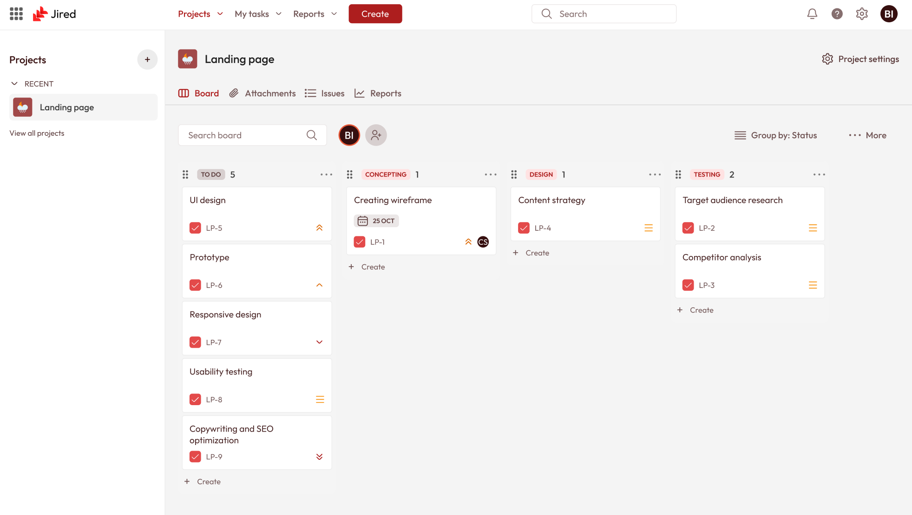

# Jired

**Автоматизированная система визуализации ведения проектов с интеллектуальной категоризацией задач**



---

## О проекте

Jired — это современный веб-клиент для системы управления проектами [Redmine](https://www.redmine.org/), расширяющий её функциональность за счёт:

* Удобной Kanban-доски с поддержкой drag-and-drop
* Автоматической семантической группировки задач с использованием больших языковых моделей (LLM)
* Наглядной визуализации зависимостей и аналитических отчётов (диаграмма Ганта, burndown chart)

Система разработана в рамках выпускной квалификационной работы (ВКР) на кафедре ИУ5 МГТУ им. Н.Э. Баумана. Jired работает как надстройка над существующим Redmine через его REST API, не требуя миграции данных или изменения серверной инфраструктуры.

---

## Основные возможности

* **Управление проектами и задачами** — создание, редактирование, назначение исполнителей, отслеживание статусов
* **Kanban-доска** — визуальное управление потоком задач с перетаскиванием карточек между колонками
* **Интеллектуальная категоризация** — автоматическое предложение групп задач на основе семантического анализа названий и описаний (через LLM API)
* **Ручная группировка** — возможность самостоятельно объединять задачи в логические группы
* **Визуализация зависимостей** — отображение связей «блокирует/блокируется» и «предшествует/следует»
* **Аналитические отчёты:**
  * Диаграмма Ганта с учётом зависимостей и сроков
  * График сгорания задач (Burndown Chart)
* **Интеграция с Redmine** — бесшовная работа с существующей базой проектов и задач
* **Контейнеризация** — быстрый запуск всех компонентов через Docker Compose

---

## Технологический стек

| Компонент | Технологии |
|---|---|
| Фронтенд | React, styled-components, react-beautiful-dnd, React Query |
| Бэкенд (BFF) | Node.js + Express (проксирование запросов к Redmine API и LLM) |
| База данных | PostgreSQL (в контейнере) |
| Сервер проектов | Redmine (официальный образ Docker) |
| Контейнеризация | Docker, Docker Compose |
| LLM-сервис | YandexGPT API (возможна замена на другой OpenAI-совместимый сервис) |

---

## Требования

* **Docker** версии 20.10 или выше
* **Docker Compose** версии 1.29 или выше
* Доступ в интернет для загрузки образов и работы LLM-сервиса
* API-ключ YandexGPT (или другого LLM-провайдера)

---

## Структура проекта

```
jired/
├── client/                # React-приложение (Jired)
│   ├── Dockerfile
│   ├── nginx/
│   │   └── nginx.conf     # Конфигурация Nginx для продакшн-сборки
│   └── ...
├── middleware/            # Промежуточный сервер (LLM-группировка)
│   ├── Dockerfile
│   ├── server.js
│   ├── routes/
│   │   └── groupIssues.js
│   └── ...
├── redmine-storage/       # Тома для хранения данных Redmine
├── docker-compose.yml     # Конфигурация запуска всех сервисов
└── README.md
```

---

## Быстрый старт

### 1. Клонируйте репозиторий

```bash
git clone https://github.com/Bizerman/Jired.git
cd jired/jired
```

### 2. Настройте переменные окружения

Перед запуском **обязательно** укажите действующий API-ключ LLM-сервиса. Откройте файл `docker-compose.yml` и замените плейсхолдер на ваш ключ:

```yaml
middleware:
  environment:
    - YANDEXGPT_API_KEY=ваш_реальный_ключ
    - YANDEXGPT_FOLDER_ID=ваш_идентификатор_каталога
    - PORT=3001
```

> **Важно:** никогда не коммитьте реальные ключи в репозиторий! Используйте плейсхолдеры для публичного кода.

### 3. Запустите систему

```bash
docker compose up -d
```

Первая сборка может занять несколько минут, так как будут загружены образы и установлены зависимости.

### 4. Откройте приложение

* **Jired (клиент):** [http://localhost:8080](http://localhost:8080)
* **Redmine (сервер):** [http://localhost](http://localhost)

Для входа в Jired используйте **API-ключ** пользователя Redmine (необходимо включить в настройках опцию REST API и ключ станет доступен в настройках профиля Redmine: *My account → API access key*).

---

## Конфигурация

Все основные параметры задаются через переменные окружения в `docker-compose.yml`:

| Переменная | Описание | Значение по умолчанию |
|---|---|---|
| `YANDEXGPT_API_KEY` | API-ключ для доступа к YandexGPT | (обязательно) |
| `YANDEXGPT_FOLDER_ID` | Идентификатор каталога в Yandex Cloud | (обязательно) |
| `REDMINE_ATTACHMENTS_STORAGE` | Способ хранения вложений (`db` или `file`) | `db` |
| `REDMINE_SECRET_KEY_BASE` | Секретный ключ Redmine (сгенерируйте свой) | `любая_длинная_строка` |

Вы можете легко сменить LLM-провайдера, отредактировав файл `middleware/routes/groupIssues.js`.

---

## Обновление

Чтобы применить изменения в клиентской части, пересоберите только фронтенд:

```bash
docker compose build --no-cache frontend
docker compose up -d frontend
```

Аналогично для middleware:

```bash
docker compose build --no-cache middleware
docker compose up -d middleware
```

---

## Остановка

```bash
docker compose down
```

Все данные Redmine (проекты, задачи, пользователи) сохраняются в томе `postgresql-data` и не удаляются при остановке контейнеров.

---

## Руководство администратора

Подробная инструкция по развёртыванию и эксплуатации системы приведена в документе **«Руководство администратора»**, который прилагается к ВКР.

---

## Лицензия

Проект разработан в образовательных целях. Использование в коммерческих проектах допускается с указанием авторства.
```